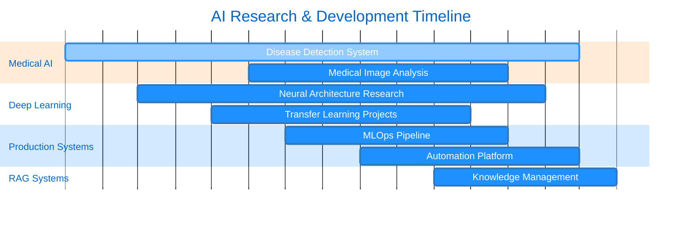

<div align="center">

#  Yasa

[](https://git.io/typing-svg)


### 🎓 Computer Engineering • 🔬 AI Researcher • 🏥 Medical AI Specialist

<p align="center">
  
  
  
</p>

[](https://t.me/Ycmmn)
[](mailto:Yasa.aidv@gmail.com)
[](https://github.com/ycmmn)


</div>

---

## 🚀 About Me

```python
class AIResearcher:
    def __init__(self):
        self.name = "Yasa"
        self.role = "AI Researcher & Deep Learning Engineer"
        self.education = "Computer Engineering"
        self.certifications = ["CS50x", "CS50p", "CS50 AI"]
        self.passions = [
            "🏥 Medical AI & Healthcare Innovation",
            "🧠 Neural Networks & Deep Learning",
            "🤖 Intelligent Automation Systems",
            "👁️ Computer Vision & NLP",
            "🔬 Transfer Learning & Transformers"
        ]
        self.current_focus = "Building AI that enhances human life"
```

> **🎯 Mission:** Bridging the gap between cutting-edge AI research and real-world applications that make a meaningful impact on healthcare and society.


---

## 🏗️ Technology Stack

<div align="center">

### 🧠 Core AI/ML Frameworks


### 👁️ Computer Vision & NLP


### 🚀 Development & Deployment


### 📊 Data & Databases


</div>

---

## 🏆 Featured Projects & Research



<div align="center">

| 🎯 Project | 📋 Description | 🛠️ Tech Stack | 📈 Status |
|---------|-------------|------------|--------|
| 🏥 **Medical AI Diagnostic** | Deep learning for medical image analysis & disease detection | PyTorch • TensorFlow • OpenCV • ResNet | 🟢 Active |
| 🤖 **AI Automation Platform** | Intelligent data processing & cataloging system | Streamlit • FastAPI • n8n • AI Agents | 🟢 Active |
| 🧠 **Neural Architecture Lab** | Custom architectures & transfer learning experiments | PyTorch • Transformers • Hugging Face | 🟢 Active |
| 📚 **RAG Knowledge System** | Advanced retrieval-augmented generation | LangChain • Vector DB • LLMs • Embeddings | 🟡 Research |
| 🔄 **MLOps Pipeline** | End-to-end ML with automated deployment | Docker • Kubernetes • MLflow • CI/CD | 🟡 In Progress |

</div>
---

<div align="center">


### ⚡ "Building the future of AI, one neural network at a time" ⚡

**Made with 💙 by Yasa | Powered by AI Research & Innovation**


</div>
