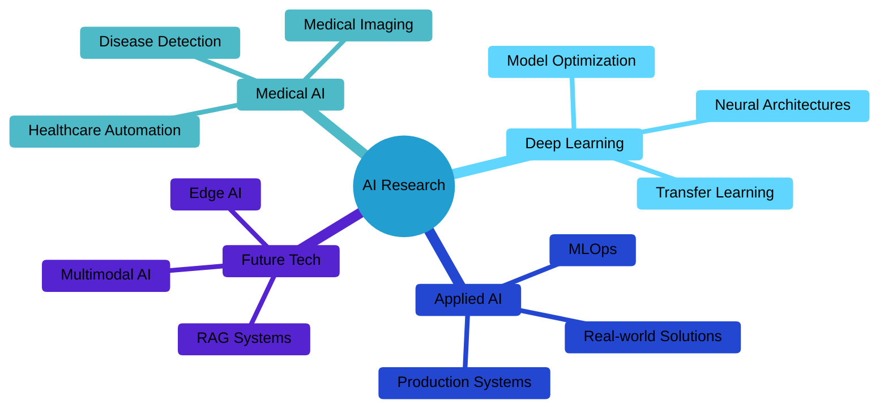

<div align="center">

#  Yasa

[](https://git.io/typing-svg)


### 🎓 Computer Engineering • 🔬 AI Researcher • 🏥 Medical AI Specialist

[](https://t.me/Ycmmn)
[](mailto:Yasa.aidv@gmail.com)
[](https://github.com/ycmmn)

</div>

---

## 🚀 About Me

```python
class AIResearcher:
    def __init__(self):
        self.name = "Yasaman Soleimani"
        self.role = "AI Researcher & Deep Learning Engineer"
        self.passions = [
            "Medical AI & Healthcare Innovation",
            "Neural Networks & Deep Learning",
            "Intelligent Automation Systems",
            "Computer Vision & NLP"
        ]
        self.current_focus = "Building AI that enhances human life"
    
    def expertise(self):
        return {
            "research": ["Deep Learning", "Transfer Learning", "Transformers"],
            "domains": ["Medical Imaging", "AI Automation", "Knowledge Systems"],
            "development": ["Production AI", "MLOps", "API Design"]
        }
```

> **🎯 Mission:** Bridging the gap between cutting-edge AI research and real-world applications that make a meaningful impact on society.

---

## 💡 Core Expertise

<table>
<tr>
<td width="50%">

### 🧠 AI & Machine Learning
- 🔬 **Deep Learning Architecture Design**
- 🎯 **Transfer Learning & Fine-tuning**
- 🤖 **Transformers & Attention Mechanisms**
- 📊 **Computer Vision & Image Processing**
- 💬 **Natural Language Processing**
- 🏥 **Medical AI & Healthcare Applications**

</td>
<td width="50%">

### ⚙️ Engineering & Development
- 🚀 **Production ML Systems**
- 🐳 **Docker & Kubernetes**
- 🌐 **FastAPI & RESTful APIs**
- 🔄 **AI Automation (n8n, Agents)**
- 📈 **Data Pipeline Engineering**
- 🛠️ **MLOps & Model Deployment**

</td>
</tr>
</table>

---

## 🛠️ Technology Stack

<div align="center">

### Core AI/ML Frameworks


### Computer Vision & NLP


### Development & Deployment


### Data & Databases


### Tools & Platforms


</div>

---

## 🏆 Featured Projects

<div align="center">

| Project | Description | Tech Stack |
|---------|-------------|------------|
| 🏥 **Medical AI Diagnostic System** | Deep learning models for medical image analysis and disease detection | PyTorch, TensorFlow, OpenCV |
| 🤖 **Intelligent Automation Platform** | AI-driven data processing and cataloging system | Streamlit, FastAPI, n8n, AI Agents |
| 🧠 **Neural Architecture Research** | Experimenting with custom architectures and transfer learning | PyTorch, Transformers, Hugging Face |
| 📚 **RAG Knowledge System** | Advanced retrieval-augmented generation for knowledge management | LangChain, Vector DB, LLMs |
| 🔄 **MLOps Pipeline** | End-to-end ML pipeline with automated training and deployment | Docker, Kubernetes, MLflow |

</div>

---

## 📊 GitHub Analytics

<div align="center">
  


</div>

---

## 🎓 Education & Certifications

<table>
<tr>
<td width="50%">

### 🎓 Academic Background
- **Computer Engineering**
- Focus: AI, Deep Learning, Medical Imaging
- Research: Neural Networks & Healthcare AI

</td>
<td width="50%">

### 📜 Harvard University Certifications
- ✅ **CS50x** - Introduction to Computer Science
- ✅ **CS50p** - Introduction to Programming with Python
- ✅ **CS50 AI** - Introduction to Artificial Intelligence

</td>
</tr>
</table>

---

## 🌱 Current Research & Focus



**Current Goals:**
- 🔬 Publishing research in Medical AI and Deep Learning
- 🚀 Building production-ready AI systems
- 🌍 Contributing to open-source AI projects
- 📚 Advancing knowledge in RAG and Knowledge Systems


---

## 📫 Connect With Me

<div align="center">

[](https://t.me/Ycmmn)
[](mailto:Yasa.aidv@gmail.com)
[](https://github.com/ycmmn)

</div>

---


**Thanks for visiting! Let's build the future of AI together.** 🚀


</div>
